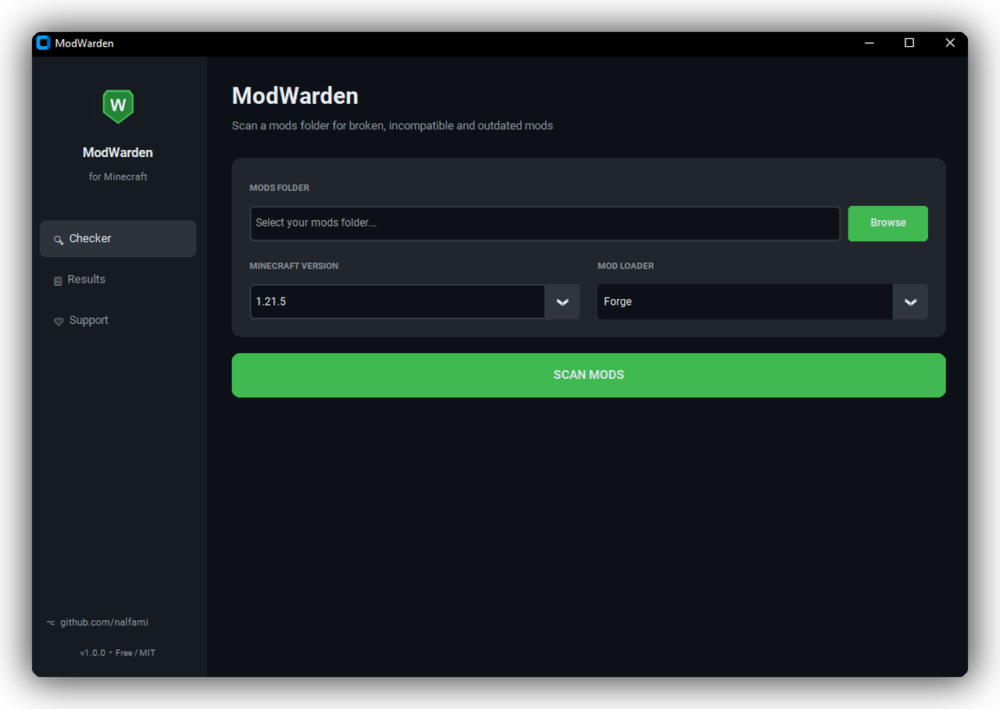
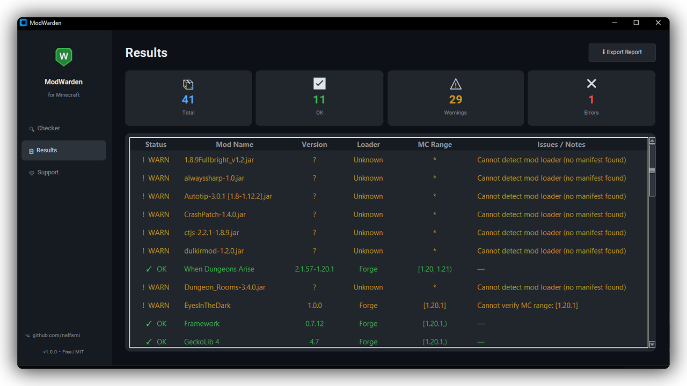

<p align="center">
  
</p>

A lightweight desktop tool that scans any Minecraft mods folder and instantly detects broken, incompatible, or outdated mods — so you spend less time troubleshooting and more time playing.

---

## Screenshots

**Checker** — select your mods folder, pick MC version and loader, hit Scan.



**Results** — every mod listed with its status, version range, loader, and detected issues.



---

## Features

| Feature | Description |
|---|---|
| 🔍 **Smart Scanner** | Reads `.jar` manifests for Fabric, Forge, NeoForge, and Quilt mods |
| 🚫 **Wrong Loader** | Detects Fabric mods in a Forge pack (and vice versa) |
| 🗓 **Version Mismatch** | Flags mods built for a different Minecraft version |
| 📦 **Missing Dependencies** | Warns when a required mod is absent from the folder |
| 🔁 **Duplicate Mods** | Finds the same mod installed multiple times |
| 💀 **Broken JARs** | Identifies corrupted or non-standard `.jar` files |
| ⬆ **Auto-Update** | Downloads the correct version of a mod directly from Modrinth |
| 📄 **Export Report** | Save scan results as `.txt` or `.json` |

---

## Supported Mod Loaders

- **Forge** — reads `META-INF/mods.toml`
- **Fabric** — reads `fabric.mod.json`
- **NeoForge** — reads `META-INF/neoforge.mods.toml`
- **Quilt** — reads `quilt.mod.json`

---

## Download

Go to [**Releases**](../../releases) and download the latest `ModWarden.exe`.  
No installation required — just run it.

---

## Usage

1. Launch `ModWarden.exe`
2. Click **Browse** and select your `mods/` folder
3. Choose your **Minecraft version** and **Mod Loader**
4. Click **SCAN MODS**
5. Review the results — click **Update Selected Mod** to auto-download a fix from Modrinth

---

## Building from Source

### Requirements
- Python 3.10+
- pip

### Steps

```bash
git clone https://github.com/nalfami/modwarden.git
cd modwarden

# Install dependencies
pip install -r requirements.txt

# Run directly
python src/main.py

# Build .exe
build.bat
```

The compiled executable will appear in `dist/ModWarden.exe`.

---

## Project Structure

```
modwarden/
├── src/
│   ├── main.py          # GUI application
│   ├── mod_parser.py    # JAR manifest parser
│   └── checker.py       # Compatibility checker + Modrinth updater
├── assets/
│   └── screenshots/     # App screenshots for README
├── dist/                # Compiled .exe (git-ignored)
├── requirements.txt
├── build.bat
└── README.md
```

---

## Sponsored

[](https://www.bisecthosting.com/clients/aff.php?aff=7308)

Need a Minecraft server? [BisectHosting](https://www.bisecthosting.com/clients/aff.php?aff=7308) offers reliable hosting with instant setup and 24/7 support.

---

## Support

If this tool saved your day, consider supporting the project:

**USDT — TRC20 (Tron Network)**
```
TRZu8DP7mdTUBgmDo22WLkwf4cqbyj5AL1
```

---

## Contact

For bug reports, partnership offers, or any questions:  
📧 **blanggglegit@gmail.com**

---

## License

MIT — free to use, modify, and distribute.
